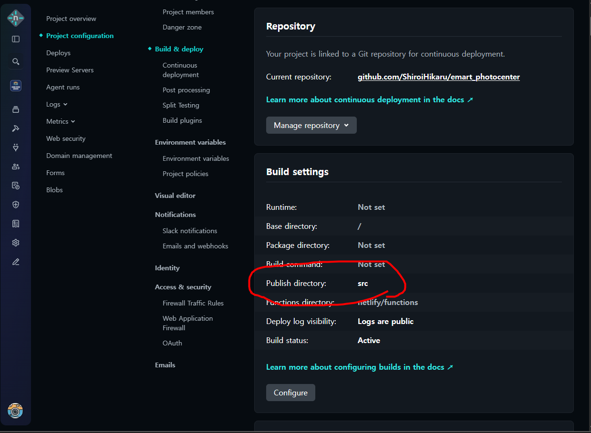

# 25.12.01~05 - 백희연의 세번째 회고

### CSS는 고통...배포는 더 고통...

- 회고를 배운 내용 보단 일기 형식으로 작성해보라고 하신 것 같아서 조금 풀어진 마음으로 적어보겠습니다.

- 이 회고는 마이클잭슨 노래모음과 함께합니다.


1. 수업에 대한 회고
   CSS!!!! 입력 속성과 값에 따라 디자인 레이아웃이나 컬러가 바뀌는건 정말 신기하고 재밌는 일이다!

하지만 수박 겉 핥기 식으로만 알고 있었던 CSS를 개편(?)된 속성들과 작동원리들을 꼼꼼히 파보면서 수업을 들으니 솔직히 머리에 쥐가 나고 놓치게 되면 어디지? 이러다가 헤벌레 하게 되었다...ㅠ

특히 논리속성이 너무 헷갈렸다.
일단 머리에 새겨넣은건 inline은 좌우, block은 상하, 그래서 inline-size는 가로크기, block-size는 세로크기...

아 그리고 중첩선택자! 이건 꼭 습관들여야 할 것같다.

float랑은 과연 친해질 수 있을까요..?

아 하지만 flex는 진짜 눈에 쌍심지를 켜며 수업에 집중하였습니다. grid도 매우 기대되는 부분이에요.

---

2. 수업시간에 배웠던 내용을 개인 프로젝트 유지보수에 반영했었을 때 반응

이전부터 개인 프로젝트로 엄마가 운영하고 있는 사진관의 랜딩페이지를 netlify로 배포하고 있었다.

원래는 개인 프로젝트 개념이라 생각하고 가볍게 여겼는데 이전에 홈페이지 가격표랑 현장안내 가격이랑 왜 틀리냐고 컴플레인이 들어온 적이 있어서 그 뒤로는 거진 공식 계정으로 관리하고 있다.

솔직히 누가 볼까ㅋㅋ 싶었는데 생각보다 많이 보고 온다는 피드백이 있어서 사태의 심각성을 조금 느꼈다.

고객 접수를 받던 카카오톡 계정이 변경되면서 변경된 내용을 수정 반영하여야 했는데 멋모르고 push 하는 과정에서 개인 계정(이하 계정 A)이 아닌 수업계정(계정 B)에 배포를 하였다...

찾아보니 깃허브 계정은 연동 시 오직 하나의 계정만 연동할 수 있고 연동을 끊으려면 **'자격 증명 관리자'**에서 부여된 깃허브 계정을 삭제하고 사용하고자 하는 계정으로 재연동을 했어야 했다.

혹시나 2개의 계정을 다 같이 쓸 수 있는 방법이 있나 찾아봤으나 일단 최선의 방법은 그저 자격 증명 관리자를 삭제하고 연동하는 방식 밖에 없다고...

근데 분명히 방법이 있을거 같은데 못 찾은거 같아서 더 깊게 파밍해봐야겠다.

다만 고쳐야 할 정보들을 고치면서 CSS를 확인해보니 남발되어 있는 속성들과 지원되지도 않는 웹폰트가 맞지 않게 끼어져 있어서 자바스크립트 수업을 들으면서 같이 개인 포트폴리오로 디자인도 더 깔끔하게 작업해서 대규모 리뉴얼 공사를 해보는 것을 가져가 보면 좋을 것 같다.

아 참고로 javascript 배우면서 같이 가져갈려고 하는 이유는 카카오 비즈니스 계정을 퍼오기 하려면 javascript로 퍼와야하는데 일단 코드 정리도 필요하고...어떻게 퍼와야 할 지 모르겠어요.

배포과정에서도 역시나 문제가 있었다.
기존의 alt + shift + O 형식의 live Server 구동이 아닌 localhost로 돌려보고 싶어서 1주차에 배웠던 npm을 설치하였는데 localhost까지는 성공하였으나 src 디렉토리 안에 이미지들을 넣어줘야 한다고 해서 무턱대고 옮겼더니 기존 배포되고 있는 경로 유실로 잠깐 404 not found 상태로 있었다.

(근데 npm run dev가 아닌 npm start 명령어로 입력해야 실행되요.)

와중에 netlify 계정을 아이디 까지 잊어버려서 netlify한테 해당 url 연동 계정 찾아주세요라고 문의했더니 10분만에 답변이 와서 로그인에는 별 문제 없이 성공했다.(반대시차가 최고인거 같다.)

이제 경로만 수정하면 되는데 그 사이에 netlify의 UI도 교체되서 어디를 수정해야 하나 헤맸는데

```
프로젝트 선택 > Project configuration > Build & deploy > Continuous deployment > Build settings > Publish directory에 src

```

순서로 설정하여 배포위치를 src로 설정하였다. (index.html은 알아서 찾는듯..네트리파이의 작동방식 공부거리 추가 +1! 아니면 공식한테 물어보는 것도 방법일듯 하다.)



배운 지식을 응용하여 보다 나은 환경을 구축할 수 있었고 반대로 그 동안 얼마나 무턱대고 짜왔는지 짚어볼 수 있는 유지보수였던거 같다.

천천히 조금씩 뜯어보면서 html에는 접근성도 추가해보고 CSS는 논리속성자로 수정해봐야지.
